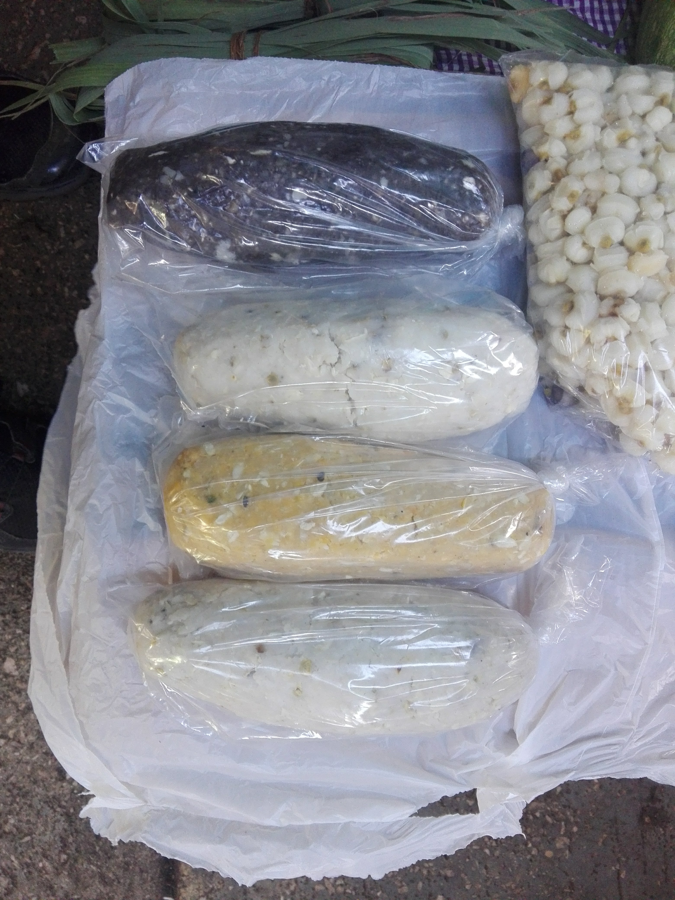

# *Weissella confusa* analysis

Repository that contain the workflow followed in the manuscript:

***Weissella confusa* and its potential to assimilate pozol carbohydrates**

This work was carried out at the Biotechnology Institute of the National Autonomous University of Mexico, in the Enzymatic Technology laboratory led by **Dr. Agustín López Munguía Canales**.

All analysis were done on the "chichen" server of the UNAM Center for Genomic Sciences.

### Workflow

The Analysis were performed following this workflow, which can be found in the **analysis** directory and its results in the **out** directory of this repository.

1. Taxonomy_16S

   ```bash
   
   ```

2. Genome assemblies

   ```bash
   quality_and_assemblies.sh
   assembly_refinement.sh
   compare_assemblies_and_coverage_estimation.sh
   ```

3. Weissella taxonomic assignment

   ```bash
   housekeeping_genes_phylogeny.sh
   ribosomal_proteins_phylogeny.sh
   ANI.sh
   ```

4. CAZy anotate

   ```bash
   cazy_analysis.sh
   ```

5. Plots

   ```bash
   Boxplots_OD_and_Enzymatic_activity.R
   CAZy_heatmap.R
   ```


####                                                   **Pozol**




**Nijmé**
Nga tjo ts’ien nijmé,
xikoni tsa kjifí nixtjíná,
inimána xi titjó, xi kjamaxcha,
kuí xi nda, kuí xi nño,
kuí xi ngasandie, kuí xi inimana.
**El maíz**
Cuando brota el embrión del maíz,
siento que se prolongan nuestros días,
es nuestro corazón que germina y crece,
es el pozol, es la tortilla,
es el mundo, es la vida.
**JUAN GREGORIO REGINO** (poeta mazateco)
